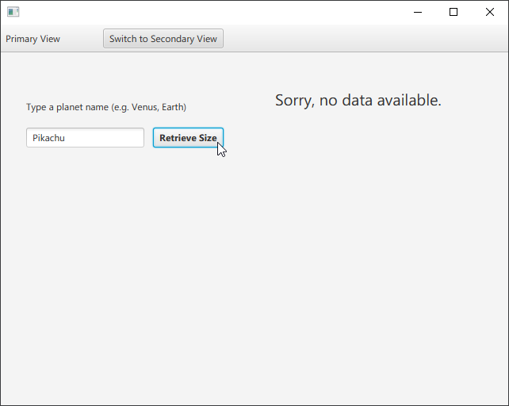

# javafx-planets-dbdemo
This is a very simple demo of how to work with a SQLite database in a JavaFX setting.

## Significant files
- `App.java` - JavaFX main class.
- `DatabaseManager.java` - helper class to manage the SQLite JDBC connection so that no other class has to.
- `Planet.java` - MVC "model" class.
- `primary.fxml` - MVC "view" file.
- `PrimaryController.java` - MVC "controller" class.

## Significant parts of `DatabaseManager.java`
- `openConnection()` and `closeConnection()` are just convenient wrappers around the JDBC open/close connection cycle.
- `createTheOnlyTableWeNeed()` and `setupDummyData()` are only used if required, by...
- `setupDatabaseOnFirstRun()`, which first checks if the database is already there.
- `fetchPlanetByName(...)`, the method invoked by the GUI when the user clicks the **Retrieve Size** button.

## What does the program actually do?
1. On first launch, we set up a database of planets and their sizes (see `DatabaseManager.setupDatabaseOnFirstRun()`).
2. Users can type some text and attempt to retrieve the size for the planet of the same name.
3. If the planet exists, they get the size (radius of planet in km).
4. If the planet does not exist, the user is told that no data is available.

